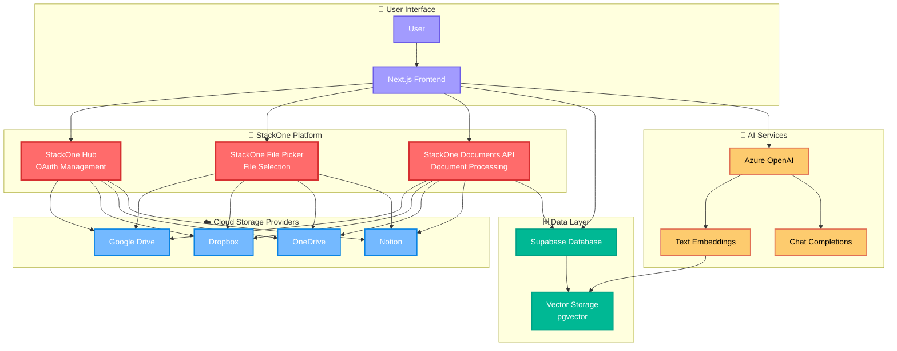
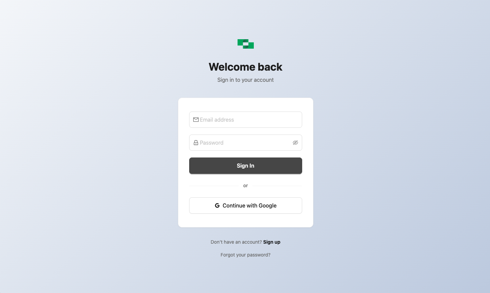
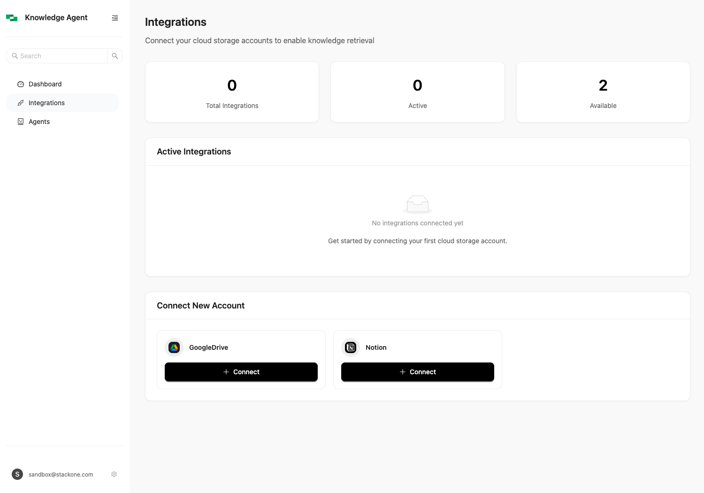
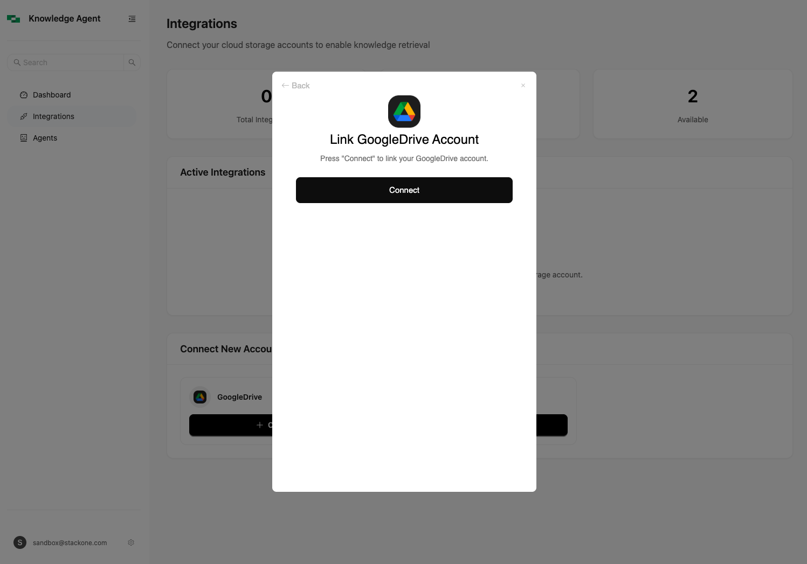
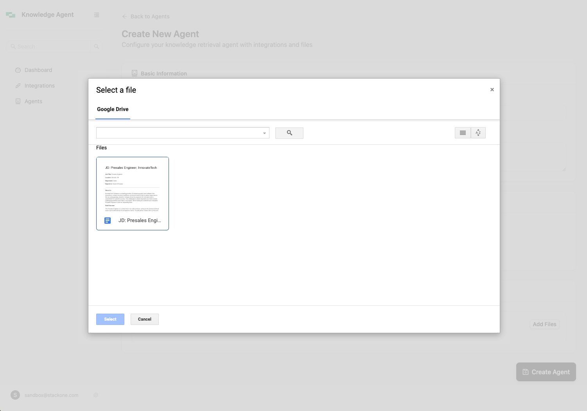
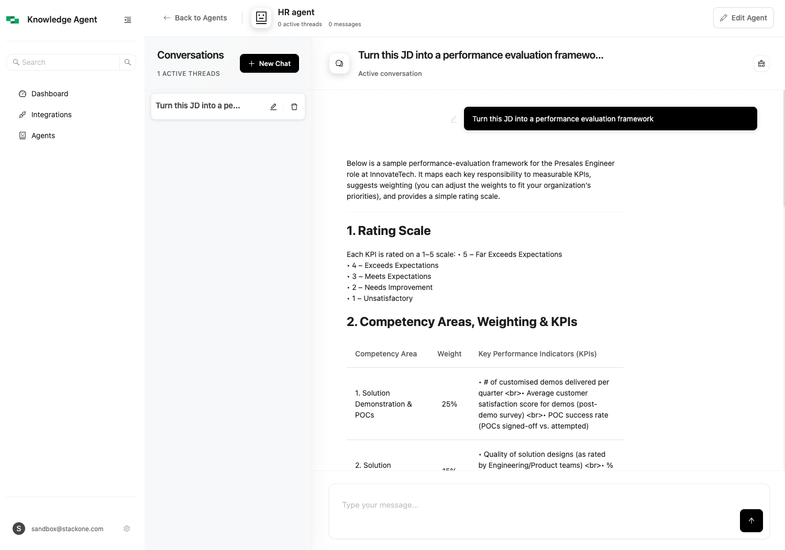

# StackOne Knowledge Agent Demo

A Next.js application that demonstrates how to build AI-powered document chat using [StackOne's Documents API](https://docs.stackone.com/docs/documents-api). This demo shows how to connect multiple cloud storage providers, process documents, and create intelligent AI agents that can answer questions from your documents.

## 📋 Table of Contents

- [🚀 Quick Start](#-quick-start)
- [🎯 Why We Built This](#-why-we-built-this)
- [🏗️ How We Built This](#️-how-we-built-this)
- [📱 Screenshots](#-screenshots)

## 🚀 Quick Start

### **Prerequisites**
- Node.js 18+ and npm
- [StackOne account](https://stackone.com) with Documents API access
- [Supabase project](https://supabase.com) with pgvector extension
- [Azure OpenAI resource](https://azure.microsoft.com/en-us/products/ai-services/openai-service)

### **Setup**

1. **Clone and Install**
   ```bash
   git clone <repository-url>
   cd react-nextjs-knowledge-agent
   npm install
   ```

2. **Environment Setup**
   ```bash
   cp env.example .env.local
   ```
   
   Configure your `.env.local`:
   ```bash
   # Supabase
   NEXT_PUBLIC_SUPABASE_URL=your_supabase_url
   NEXT_PUBLIC_SUPABASE_ANON_KEY=your_supabase_anon_key
   
   # Azure OpenAI
   AZURE_OPENAI_KEY=your_api_key
   AZURE_OPENAI_ENDPOINT=https://your-resource.openai.azure.com/
   AZURE_EMBEDDING_DEPLOYMENT=text-embedding-ada-002
   AZURE_LLM_DEPLOYMENT=gpt-4
   
   # StackOne
   STACKONE_API_KEY=your_stackone_api_key
   STACKONE_HUB_URL=https://hub.stackone.com
   ```

3. **Database Setup**
   - Create a Supabase project and enable the pgvector extension
   - Run the SQL schema from `supabase-schema.sql` in your Supabase SQL editor

4. **Run the Application**
   ```bash
   npm run dev
   ```
   
   Visit [http://localhost:3000](http://localhost:3000)

### **User Workflow**

1. **Sign In**: Authenticate with Google OAuth
2. **Connect Storage**: Use StackOne Hub to connect Google Drive, Dropbox, OneDrive, or Notion
3. **Create Agent**: Create an AI agent and select which documents it can access
4. **Chat**: Ask questions about your documents and get AI-powered answers with source citations

## 🎯 Why We Built This

This demo showcases the key capabilities of StackOne's platform for building AI-powered document applications:

### **The Problem**
- Documents are scattered across multiple cloud storage providers (Google Drive, Dropbox, OneDrive, Notion)
- Each provider has different APIs, authentication flows, and file formats
- Building document AI applications requires complex integrations and processing pipelines

### **The Solution**
StackOne provides a unified platform that simplifies:
- **Multi-Provider OAuth**: Connect to multiple cloud storage providers with one integration
- **Unified Document API**: Access documents from any provider with consistent APIs
- **File Picker Component**: Let users select files across providers with a single interface
- **Document Processing**: Automatic text extraction and processing from various file formats

### **What This Demo Shows**
- How to build AI agents that can answer questions from documents across multiple cloud providers
- How to create a seamless user experience for connecting and managing cloud storage
- How to process documents at scale for RAG (Retrieval-Augmented Generation) applications
- How to build production-ready document AI applications with proper security and data isolation

## 🏗️ How We Built This

### **System Architecture**



### **Component Interactions**

1. **Authentication Flow**: User → StackOne Hub → Cloud Provider OAuth
2. **File Selection**: User → StackOne File Picker → Browse Cloud Storage
3. **Document Processing**: StackOne API → Fetch Documents → Supabase Storage
4. **AI Pipeline**: Documents → Text Extraction → Chunking → Embeddings → Vector Storage
5. **Chat Flow**: User Query → Vector Search → Context Retrieval → AI Response

### **Key Components**

1. **StackOne Integration**
   - **StackOne Hub**: Embedded OAuth flows for connecting cloud storage accounts
   - **StackOne File Picker**: React component for selecting files across providers
   - **StackOne Documents API**: Unified API for accessing documents from any provider

2. **AI Processing Pipeline**
   - **Document Ingestion**: Fetch documents from connected cloud storage
   - **Text Extraction**: Extract content from PDFs, Word docs, Google Docs, etc.
   - **Chunking**: Split documents into optimal chunks for RAG
   - **Embeddings**: Generate vector embeddings using Azure OpenAI
   - **Storage**: Store embeddings in Supabase with pgvector

3. **Chat Interface**
   - **RAG Query**: Vector similarity search to find relevant document chunks
   - **AI Response**: Generate contextual answers using Azure OpenAI
   - **Source Citations**: Show which documents informed the response

### **Technology Stack**
- **Frontend**: Next.js 15, React 18, TypeScript
- **Database**: Supabase (PostgreSQL + pgvector)
- **AI**: Azure OpenAI (GPT-4 + text-embedding-ada-002)
- **Document Processing**: StackOne Documents API
- **UI**: Ant Design + custom components


## 📱 Screenshots

### Login Page

*Clean authentication interface with Google OAuth integration*

### Dashboard Overview

*Overview of your knowledge agents, integrations, and recent conversations*

### Integration Management

*Connect and manage your cloud storage accounts through StackOne Hub*

### StackOne Hub OAuth Flow

*Secure OAuth flow for connecting cloud storage providers*

### Agent Creation with File Picker

*Create specialized AI agents with access to specific document sets*

### StackOne File Picker

*File picker interface showing Google Drive files and folders*

### Chat Interface

*Realtime chat powered by document RAG architecture*

## 📚 Additional Resources

- [StackOne Documentation](https://docs.stackone.com/)
- [Supabase Vector Search](https://supabase.com/docs/guides/ai/vector-search)
- [Azure OpenAI Service](https://docs.microsoft.com/en-us/azure/cognitive-services/openai/)
- [Next.js Documentation](https://nextjs.org/docs)

---

**Built with ❤️ using [StackOne](https://stackone.com) - The unified API for cloud storage integrations.**