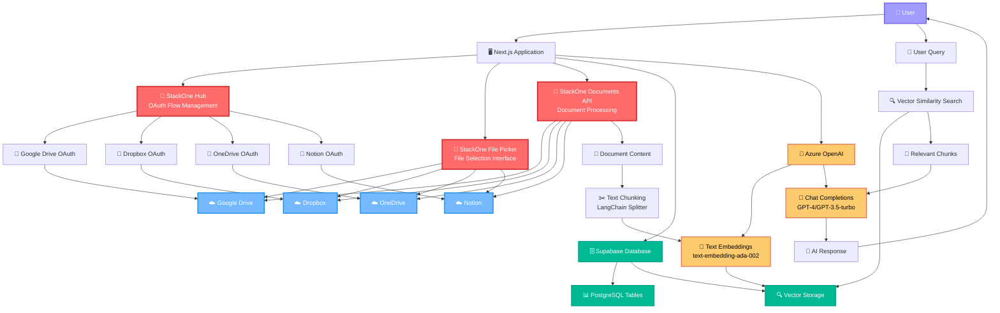
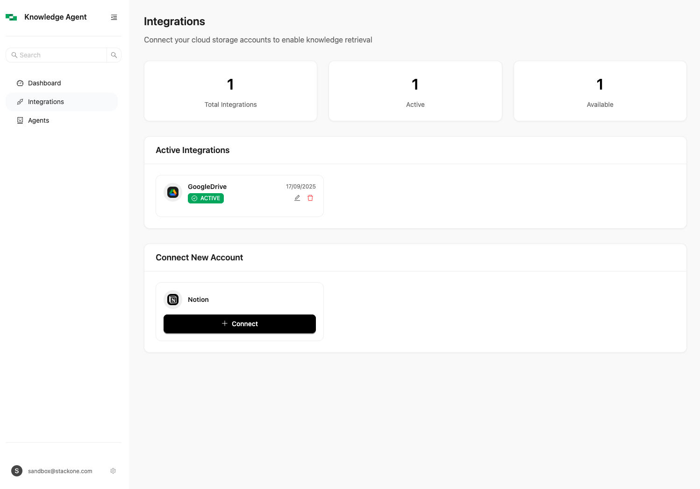
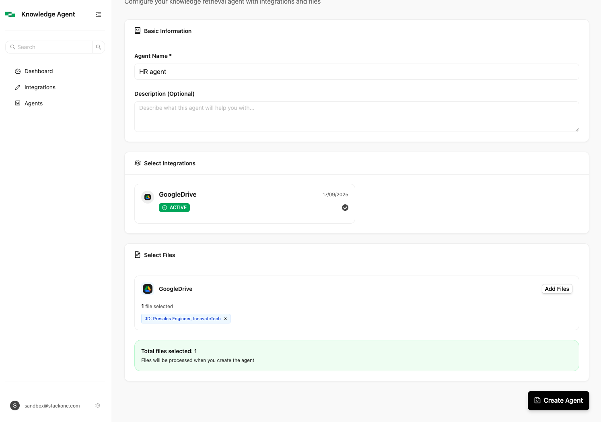
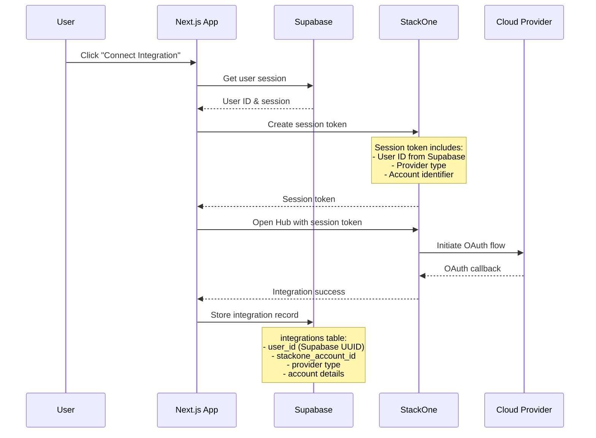
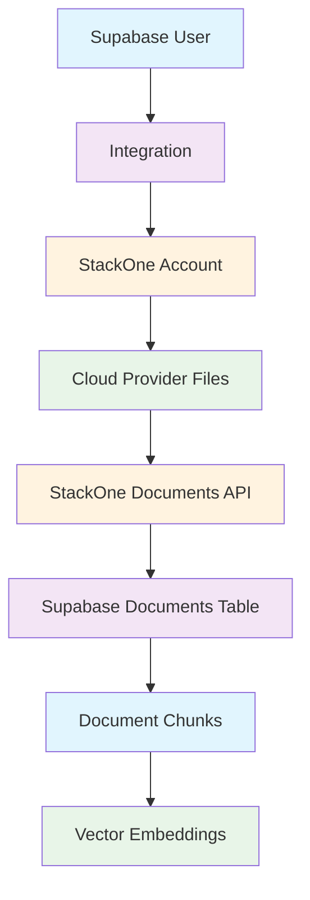
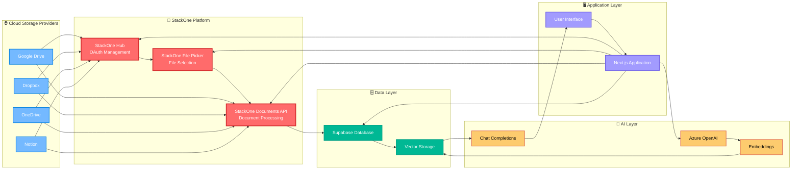

# StackOne Knowledge Agent Demo

A comprehensive Next.js application that demonstrates the power of [StackOne's Documents API](https://docs.stackone.com/docs/documents-api) for building Retrieval-Augmented Generation (RAG) applications. This demo showcases how to seamlessly integrate multiple cloud storage providers, process documents at scale, and create intelligent AI agents that can answer questions from your documents.

## 🚀 StackOne Platform Features Demonstrated

This application showcases the following key StackOne capabilities:

### 📄 **Unified Documents API**
- **Multi-Provider Support**: Seamlessly connect to Google Drive, Dropbox, OneDrive, and more
- **Document Processing**: Automatic text extraction and content processing from various file formats
- **Real-time Sync**: Keep your documents in sync with source providers
- **Metadata Extraction**: Rich document metadata including file types, sizes, and timestamps

### 🔗 **StackOne Hub Integration**
- **OAuth Flow Management**: Secure, embedded OAuth flows for connecting cloud storage accounts
- **Session Management**: Robust session handling with automatic token refresh
- **Multi-Account Support**: Connect multiple accounts from the same or different providers
- **Provider-Specific Features**: Leverage native features of each cloud storage provider

### 📁 **File Picker Component**
- **Intuitive File Selection**: Browse and select files from connected cloud storage accounts
- **Real-time Preview**: See file metadata and previews before selection
- **Bulk Operations**: Select multiple files across different providers
- **Smart Filtering**: Filter by file type, size, and other metadata

### 🔄 **Document Processing Pipeline**
- **Automatic Chunking**: Intelligent document splitting using LangChain's text splitters
- **Vector Embeddings**: Generate embeddings using an Azure OpenAI embedding model
- **Content Extraction**: Extract text from PDFs, Word docs, Google Workspace files, and more
- **Format Conversion**: Automatic conversion of Google Workspace documents to markdown/text

## 🏗️ Architecture

This application demonstrates a production-ready RAG architecture with **StackOne components highlighted in red**:



### Architecture Components

- **[StackOne Documents API](https://docs.stackone.com/docs/documents-api)**: Unified API for accessing documents from multiple cloud storage providers
- **[StackOne Hub](https://docs.stackone.com/docs/hub)**: Embedded OAuth flow management
- **[StackOne File Picker](https://docs.stackone.com/docs/file-picker)**: React component for file selection
- **Azure OpenAI**: For text embeddings and LLM responses
- **Supabase**: Native vector storage with pgvector extension for similarity search
- **LlamaIndex**: Chat UI components for the user interface
- **Next.js**: Full-stack React framework with TypeScript


## ✨ Key Features

### 🔐 **Secure Multi-Provider Integration**
- Connect to Google Drive, Notion, and other cloud storage providers
- OAuth 2.0 flows managed by StackOne Hub
- Secure session management with automatic token refresh
- Support for multiple accounts per provider

### 📊 **Intelligent Document Processing**
- Automatic document ingestion from connected cloud storage
- Smart text extraction from various file formats (PDF, DOCX, Google Docs, etc.)
- Document chunking optimized for RAG applications
- Vector embeddings using Azure OpenAI's latest models

### 🤖 **AI-Powered Chat Interface**
- Create specialized AI agents for different document sets
- Natural language querying of your documents
- Context-aware responses with source citations
- Conversation history and thread management

### 🎯 **Production-Ready Features**
- Multi-tenant architecture with proper data isolation
- Real-time document processing with status tracking
- Comprehensive error handling and logging
- Responsive UI with modern design patterns

## 📱 Application Screenshots

The following screenshots showcase the key features and user interface of the StackOne Documents API demo:

### Login Page

*Clean authentication interface with Google OAuth integration*

### Dashboard Overview

*Overview of your knowledge agents, integrations, and recent conversations*

### Integration Management

*Connect and manage your cloud storage accounts through StackOne Hub*

### StackOne Hub OAuth Flow

*Secure OAuth flow for connecting cloud storage providers - showing the embedded StackOne Hub interface*

### Successful Integration

*Google Drive integration successfully connected and showing as active*

### Agent Creation with File Picker

*Create specialized AI agents with access to specific document sets using StackOne File Picker*

### StackOne File Picker

*File picker interface showing Google Drive files and folders with search functionality*

### File Selection in Action

*Demonstrating file selection from Google Drive using the StackOne File Picker component*

### Chat Interface

*Realtime chat powered by document RAG architecture*

## 🗄️ Database Schema

The application uses a well-structured PostgreSQL schema with the following main tables:

- **`integrations`**: User's cloud storage integrations (Google Drive, Dropbox, etc.)
- **`documents`**: Documents fetched from StackOne with metadata
- **`document_chunks`**: Document chunks with vector embeddings for similarity search
- **`agents`**: AI chat agents with access to specific document sets
- **`chat_messages`**: Conversation history and thread management
- **`threads`**: Chat conversation threads for organizing conversations

## 🔗 User & Integration Mapping: Supabase ↔ StackOne

Understanding how users and integrations are mapped between Supabase and StackOne is crucial for building and maintaining this application. This section explains the relationship and data flow between these two systems.

### 👤 User Identity Management

#### **Supabase Auth Users**
- **Primary Identity**: Supabase Auth serves as the primary user identity system
- **Authentication**: Handles user registration, login, password management, and email confirmation
- **User ID**: Each user gets a unique UUID (`auth.users.id`) that serves as the primary key across all application tables
- **Session Management**: Manages user sessions, JWT tokens, and authentication state

#### **StackOne User Context**
- **Session Tokens**: StackOne uses session tokens to identify users during OAuth flows
- **Temporary Identity**: StackOne session tokens are temporary and tied to specific OAuth flows
- **No Persistent User Storage**: StackOne doesn't store user identities; it relies on your application's user management

```typescript
// User mapping flow
Supabase User (auth.users.id) → StackOne Session Token → Cloud Provider OAuth
```

### 🔌 Integration Management Flow

#### **1. Integration Creation Process**



#### **2. Data Mapping Structure**

| **Supabase Field** | **StackOne Field** | **Purpose** | **Example** |
|-------------------|-------------------|-------------|-------------|
| `integrations.user_id` | Session Token Context | Links integration to Supabase user | `550e8400-e29b-41d4-a716-446655440000` |
| `integrations.stackone_account_id` | Account ID | Unique identifier for the connected account | `acc_1234567890abcdef` |
| `integrations.provider` | Provider Type | Cloud storage provider type | `google_drive`, `notion_documents` |
| `integrations.account_name` | Account Display Name | Human-readable account name | `john.doe@gmail.com` |
| `integrations.account_email` | Account Email | Email associated with the account | `john.doe@gmail.com` |

#### **3. Integration Lifecycle**

```typescript
// Integration creation in Supabase
const integration = {
  user_id: supabaseUser.id,           // Links to Supabase auth.users
  provider: 'google_drive',           // Cloud provider type
  stackone_account_id: 'acc_123...',  // StackOne account identifier
  account_name: 'John Doe',           // Display name
  account_email: 'john@example.com',  // Account email
  status: 'active'                    // Integration status
}
```

### 📄 Document Processing Mapping

#### **Document Ownership Chain**



#### **Document Data Flow**

1. **User Authentication**: Supabase user authenticates and gets session
2. **Integration Selection**: User selects which integrations to use for an agent
3. **Document Retrieval**: StackOne Documents API fetches files from connected accounts
4. **Document Storage**: Files are stored in Supabase with user_id linkage
5. **Processing**: Documents are chunked and embedded with user context
6. **Query Isolation**: Vector searches are scoped by user_id for data isolation

```typescript
// Document processing with user context
const documents = await listUserDocuments(stackoneApiKey, accountId);
for (const doc of documents) {
  // Store document with user linkage
  await supabase.from('documents').insert({
    user_id: currentUser.id,           // Supabase user ID
    integration_id: integration.id,    // Links to integrations table
    stackone_document_id: doc.id,      // StackOne document ID
    name: doc.name,
    // ... other metadata
  });
}
```

### 🤖 Agent & Document Access Control

#### **Agent-Integration Relationship**

```sql
-- Agents can access multiple integrations
CREATE TABLE agents (
  id UUID PRIMARY KEY,
  user_id UUID REFERENCES auth.users(id),  -- Owner
  integration_ids UUID[] NOT NULL,          -- Array of integration IDs
  document_ids UUID[] NOT NULL,             -- Array of document IDs
  -- ... other fields
);

-- Junction table for agent-integration relationships
CREATE TABLE agent_integrations (
  agent_id UUID REFERENCES agents(id),
  integration_id UUID REFERENCES integrations(id),
  file_ids TEXT[],  -- Specific StackOne file IDs
  UNIQUE(agent_id, integration_id)
);
```

#### **Access Control Flow**

1. **User Creates Agent**: Agent is linked to user_id in Supabase
2. **Integration Selection**: User selects which integrations the agent can access
3. **Document Access**: Agent can only access documents from selected integrations
4. **Query Scoping**: All vector searches include user_id and agent_id filters

```typescript
// RAG query with proper access control
const relevantChunks = await supabase.rpc('match_documents', {
  query_embedding: questionEmbedding,
  match_threshold: 0.7,
  match_count: 20,
  document_ids: agent.document_ids,  // Only agent's documents
  user_id: currentUser.id           // Only user's data
});
```

### 🛡️ Security & Data Isolation

#### **Row Level Security (RLS)**

All tables implement RLS policies to ensure data isolation:

```sql
-- Users can only access their own integrations
CREATE POLICY "Users can view their own integrations" ON public.integrations
  FOR SELECT USING (auth.uid() = user_id);

-- Users can only access their own documents
CREATE POLICY "Users can view their own documents" ON public.documents
  FOR SELECT USING (auth.uid() = user_id);

-- Users can only access their own agents
CREATE POLICY "Users can view their own agents" ON public.agents
  FOR SELECT USING (auth.uid() = user_id);
```

#### **API Security**

```typescript
// All API routes verify user authentication
export async function GET(request: Request) {
  const supabase = await createClient();
  const { data: { user }, error } = await supabase.auth.getUser();
  
  if (error || !user) {
    return new Response('Unauthorized', { status: 401 });
  }
  
  // Proceed with user-scoped operations
  const integrations = await supabase
    .from('integrations')
    .select('*')
    .eq('user_id', user.id);
    
  return Response.json(integrations.data);
}
```

### 📊 Data Consistency & Error Handling

#### **Integration Status Management**

```typescript
// Integration status tracking
const integrationStatuses = {
  'active': 'Integration is working properly',
  'inactive': 'Integration is disabled by user',
  'error': 'Integration has authentication issues',
  'expired': 'OAuth tokens have expired'
};

// Automatic status updates
async function checkIntegrationHealth(integrationId: string) {
  try {
    const integration = await getIntegration(integrationId);
    const testResult = await testStackOneConnection(integration.stackone_account_id);
    
    if (testResult.success) {
      await updateIntegrationStatus(integrationId, 'active');
    } else {
      await updateIntegrationStatus(integrationId, 'error');
    }
  } catch (error) {
    await updateIntegrationStatus(integrationId, 'error');
  }
}
```

#### **Data Cleanup & Orphaning**

```typescript
// Clean up orphaned data when integrations are deleted
async function cleanupIntegrationData(integrationId: string) {
  // Delete associated documents
  await supabase
    .from('documents')
    .delete()
    .eq('integration_id', integrationId);
    
  // Delete document chunks
  await supabase
    .from('document_chunks')
    .delete()
    .in('document_id', 
      supabase.from('documents')
        .select('id')
        .eq('integration_id', integrationId)
    );
    
  // Update agents to remove this integration
  await supabase
    .from('agents')
    .update({ integration_ids: sql`array_remove(integration_ids, ${integrationId})` })
    .contains('integration_ids', [integrationId]);
}
```

### 🔍 Troubleshooting Common Issues

#### **Integration Connection Problems**

| **Issue** | **Cause** | **Solution** |
|-----------|-----------|--------------|
| Integration shows as "error" | OAuth tokens expired | Re-authenticate through StackOne Hub |
| Documents not syncing | Webhook not configured | Set up StackOne webhook endpoint |
| User can't see integrations | RLS policy issue | Verify user_id matches auth.uid() |
| Agent can't access documents | Missing integration link | Check agent_integrations table |

#### **Data Mapping Issues**

```typescript
// Debug user-integration mapping
async function debugUserIntegrations(userId: string) {
  const integrations = await supabase
    .from('integrations')
    .select(`
      *,
      documents:documents(count),
      agents:agents(count)
    `)
    .eq('user_id', userId);
    
  console.log('User integrations:', integrations.data);
  
  // Check StackOne account status
  for (const integration of integrations.data) {
    const stackoneStatus = await checkStackOneAccount(integration.stackone_account_id);
    console.log(`Integration ${integration.id}: ${stackoneStatus}`);
  }
}
```

This mapping system ensures that:
- **Users are properly isolated** and can only access their own data
- **Integrations are correctly linked** to Supabase users
- **Documents maintain proper ownership** through the user → integration → document chain
- **Agents have controlled access** to specific document sets
- **Data remains consistent** across Supabase and StackOne systems

## ⚙️ Environment Configuration

Copy `env.example` to `.env.local` and configure the following:

```bash
# Supabase Configuration
NEXT_PUBLIC_SUPABASE_URL=your_supabase_url
NEXT_PUBLIC_SUPABASE_ANON_KEY=your_supabase_anon_key

# Azure OpenAI Configuration
AZURE_OPENAI_KEY=your_gpt_api_key
AZURE_OPENAI_ENDPOINT=https://your-resource.openai.azure.com/

AZURE_EMBEDDING_DEPLOYMENT=your_embedding_deployment_name

AZURE_LLM_VERSION=2025-04-01-preview
AZURE_LLM_DEPLOYMENT=your_gpt_deployment_name

# StackOne Configuration
STACKONE_API_KEY=your_stackone_api_key
STACKONE_HUB_URL=https://hub.stackone.com
```

### 🔑 Getting Your StackOne API Key

1. Sign up for a [StackOne account](https://stackone.com)
2. Navigate to your [API Keys dashboard](https://app.stackone.com/api-keys)
3. Create a new API key with Documents API permissions
4. Copy the API key to your `.env.local` file

For detailed setup instructions, see the [StackOne Quick Start Guide](https://docs.stackone.com/docs/quick-start).

## 🚀 Quick Start

### Prerequisites

- Node.js 18+ and npm
- A [StackOne account](https://stackone.com) with Documents API access
- A [Supabase project](https://supabase.com) with pgvector extension
- An [Azure OpenAI resource](https://azure.microsoft.com/en-us/products/ai-services/openai-service) with GPT and embeddings models

### 1. Clone and Install

```bash
git clone <repository-url>
cd files-rag-demo
npm install
```

### 2. Database Setup

1. **Create a Supabase project**:
   - Go to [supabase.com](https://supabase.com) and create a new project
   - Enable the pgvector extension in your database
   - Copy your project URL and anon key

2. **Initialize the database schema**:
   ```bash
   # Run the SQL schema in your Supabase SQL editor
   cat supabase-schema.sql
   ```

### 3. StackOne Configuration

1. **Get your StackOne API key**:
   - Sign up at [stackone.com](https://stackone.com)
   - Navigate to [API Keys](https://app.stackone.com/api-keys)
   - Create a new API key with Documents API permissions

2. **Configure your environment**:
   ```bash
   cp env.example .env.local
   # Edit .env.local with your API keys
   ```

### 4. Azure OpenAI Setup

1. **Create an Azure OpenAI resource**:
   - Follow the [Azure OpenAI setup guide](https://docs.microsoft.com/en-us/azure/cognitive-services/openai/quickstart)
   - Deploy `text-embedding-ada-002` for embeddings
   - Deploy a GPT model (e.g., `gpt-4` or `gpt-3.5-turbo`) for chat

2. **Configure your models**:
   - Update the deployment names in your `.env.local`
   - Ensure your models are deployed and accessible

### 5. Run the Application

   ```bash
   npm run dev
   ```

Visit [http://localhost:3000](http://localhost:3000) to see the application in action!

## 📚 StackOne Integration Guide

### Understanding the StackOne Components

This demo showcases three key StackOne components:

#### 1. **StackOne Hub** - OAuth Flow Management
The `StackOneHub` component handles secure OAuth flows for connecting cloud storage accounts:

```typescript
// Example usage from the demo
<StackOneHub
  isOpen={isHubOpen}
  provider="google_drive"
  multiple={true}
  onSuccess={handleConnectionSuccess}
  onError={handleConnectionError}
  onClose={handleHubClose}
/>
```

**Key Features**:
- Embedded OAuth flows that don't redirect users away from your app
- Support for multiple providers (Google Drive, Dropbox, OneDrive, etc.)
- Automatic session management and token refresh
- Secure postMessage communication

**Source Code**: [`src/components/StackOneHub.tsx`](src/components/StackOneHub.tsx) | [`src/lib/stackone/session-manager.ts`](src/lib/stackone/session-manager.ts)  
**Documentation**: [StackOne Hub Guide](https://docs.stackone.com/docs/hub)

#### 2. **StackOne File Picker** - File Selection Interface
The `StackOneFilePicker` component provides an intuitive interface for selecting files:

```typescript
// Example usage from the demo
<StackOneFilePicker
  isOpen={isPickerOpen}
  onClose={handlePickerClose}
  onFilesSelected={handleFilesSelected}
  integrationIds={selectedIntegrationIds}
/>
```

**Key Features**:
- Browse files from connected cloud storage accounts
- Multi-provider file selection
- Real-time file metadata and previews
- Bulk file selection capabilities

**Source Code**: [`src/components/StackOneFilePicker.tsx`](src/components/StackOneFilePicker.tsx)  
**Documentation**: [StackOne File Picker Guide](https://docs.stackone.com/docs/file-picker)

#### 3. **StackOne Documents API** - Document Processing
The Documents API handles document retrieval and processing:

```typescript
// Example API usage from the demo
const documents = await listUserDocuments(apiKey, accountId);
const fileContent = await downloadFile(apiKey, fileId, accountId);
const metadata = await getFileMetadata(apiKey, fileId, accountId);
```

**Key Features**:
- Unified API for multiple cloud storage providers
- Automatic text extraction from various file formats
- Support for Google Workspace document conversion
- Rich metadata extraction

**Source Code**: [`src/lib/stackone/api.ts`](src/lib/stackone/api.ts) | [`src/app/api/documents/ingest/route.ts`](src/app/api/documents/ingest/route.ts)  
**Documentation**: [StackOne Documents API Reference](https://docs.stackone.com/docs/documents-api)

## 🔌 API Endpoints

### Document Management
- **`POST /api/documents/ingest`**: Ingest documents from a StackOne integration  
  *Source: [`src/app/api/documents/ingest/route.ts`](src/app/api/documents/ingest/route.ts)*
- **`GET /api/documents/ingest`**: Get document processing status and progress

### Chat & Agents
- **`POST /api/chat`**: Send a message to an AI agent  
  *Source: [`src/app/api/chat/route.ts`](src/app/api/chat/route.ts)*
- **`GET /api/chat`**: Get chat history for a specific agent
- **`POST /api/agents/process`**: Process and create new AI agents  
  *Source: [`src/app/api/agents/process/route.ts`](src/app/api/agents/process/route.ts)*

### StackOne Integration
- **`POST /api/stackone/connect-session`**: Create StackOne session tokens  
  *Source: [`src/app/api/stackone/connect-session/route.ts`](src/app/api/stackone/connect-session/route.ts)*
- **`GET /api/stackone/connectors`**: List available cloud storage connectors  
  *Source: [`src/app/api/stackone/connectors/route.ts`](src/app/api/stackone/connectors/route.ts)*
- **`POST /api/stackone/webhook`**: Handle StackOne webhook events  
  *Source: [`src/app/api/stackone/webhook/route.ts`](src/app/api/stackone/webhook/route.ts)*

### Thread Management
- **`GET /api/threads`**: List user's conversation threads  
  *Source: [`src/app/api/threads/route.ts`](src/app/api/threads/route.ts)*
- **`GET /api/threads/recent`**: Get recent conversation threads  
  *Source: [`src/app/api/threads/recent/route.ts`](src/app/api/threads/recent/route.ts)*
- **`POST /api/threads`**: Create a new conversation thread
- **`DELETE /api/threads/[id]/archive`**: Archive a conversation thread  
  *Source: [`src/app/api/threads/[id]/archive/route.ts`](src/app/api/threads/[id]/archive/route.ts)*

## 🎯 User Journey & Workflow

### 1. **Initial Setup** 
- User signs up and authenticates via Supabase Auth
- Dashboard displays empty state with setup guidance  
  *Source: [`src/app/dashboard/page.tsx`](src/app/dashboard/page.tsx)*

### 2. **Connect Cloud Storage**
- User navigates to Integrations page  
  *Source: [`src/app/integrations/page.tsx`](src/app/integrations/page.tsx)*
- Clicks "Connect Integration" to open StackOne Hub
- Completes OAuth flow for their preferred cloud storage provider
- Integration is automatically saved and activated

### 3. **Create AI Agent**
- User navigates to Agents page and clicks "New Agent"  
  *Source: [`src/app/agents/page.tsx`](src/app/agents/page.tsx) | [`src/app/agents/new/page.tsx`](src/app/agents/new/page.tsx)*
- Selects which connected integrations the agent should access
- Optionally selects specific files using StackOne File Picker
- Agent is created with access to the specified documents

### 4. **Document Processing**
- Documents are automatically ingested from connected cloud storage
- Files are processed, chunked, and embedded using Azure OpenAI
- Processing status is tracked and displayed to the user

### 5. **Chat with Documents**
- User opens the chat interface for their agent  
  *Source: [`src/app/agents/[id]/chat/page.tsx`](src/app/agents/[id]/chat/page.tsx)*
- Asks questions about their documents in natural language
- AI agent retrieves relevant document chunks and provides contextual answers
- Conversation history is saved and can be resumed later

## 🔧 Technical Implementation Details

### Architecture Flow Explanation

The diagram above illustrates how the different systems interact in this RAG demo application, with **StackOne components highlighted in red**:

#### 🔗 **StackOne Integration Flow**
1. **Authentication**: StackOne Hub manages OAuth flows with multiple cloud providers
2. **File Selection**: StackOne File Picker provides unified access to files across providers
3. **Document Processing**: StackOne Documents API fetches and processes documents from all connected sources

#### 🔄 **Data Processing Pipeline**
1. **Document Ingestion**: StackOne Documents API retrieves files from cloud storage
2. **Content Extraction**: Documents are processed to extract text content
3. **Chunking**: Text is split into optimal chunks using LangChain
4. **Embedding**: Azure OpenAI generates vector embeddings for each chunk
5. **Storage**: Embeddings are stored in Supabase's pgvector database

#### 💬 **RAG Query Flow**
1. **User Query**: User asks a question through the chat interface
2. **Vector Search**: Query is embedded and matched against stored vectors
3. **Context Retrieval**: Relevant document chunks are retrieved
4. **Response Generation**: Azure OpenAI generates contextual responses
5. **Response Delivery**: AI response is returned to the user

#### 🎯 **Key Benefits of StackOne Integration**
- **Unified API**: Single interface for multiple cloud storage providers
- **Seamless OAuth**: No need to implement provider-specific authentication
- **File Picker**: Consistent file selection experience across providers
- **Document Processing**: Automatic content extraction from various file formats

### StackOne Integration Points



### 🔄 Architecture Flexibility & Extensibility

This architecture is designed to support various permutations and configurations, making it adaptable to different use cases and requirements:

#### **Cloud Storage Provider Variations**
- **Single Provider**: Connect only to Google Drive for Google Workspace-focused applications
- **Multi-Provider**: Support Google Drive, Dropbox, OneDrive, and Notion simultaneously
- **Enterprise Focus**: Add SharePoint, Box, or other enterprise storage solutions
- **Hybrid Approach**: Mix personal (Google Drive) and enterprise (SharePoint) storage

#### **AI/ML Provider Alternatives**
- **OpenAI**: Replace Azure OpenAI with direct OpenAI API integration
- **Anthropic Claude**: Switch to Claude for different AI capabilities
- **Local Models**: Use Ollama or other local LLM solutions for on-premises deployments
- **Multi-Model**: Support multiple AI providers for different use cases

#### **Database & Vector Storage Options**
- **PostgreSQL + pgvector**: Current Supabase implementation
- **Pinecone**: Dedicated vector database for high-scale applications
- **Weaviate**: Open-source vector database with advanced features
- **Chroma**: Lightweight vector database for development and small-scale deployments
- **Qdrant**: High-performance vector database for production workloads

#### **Frontend Framework Alternatives**
- **React + Vite**: Replace Next.js with Vite for faster development
- **Vue.js**: Use Vue.js with Nuxt.js for alternative frontend approach
- **Svelte**: Lightweight SvelteKit implementation
- **Mobile Apps**: React Native or Flutter mobile applications
- **Desktop Apps**: Electron or Tauri desktop applications

#### **Deployment & Infrastructure Variations**
- **Serverless**: Deploy on Vercel, Netlify, or AWS Lambda
- **Containerized**: Docker containers on Kubernetes or Docker Swarm
- **On-Premises**: Self-hosted solutions for enterprise environments
- **Hybrid Cloud**: Mix of cloud and on-premises components
- **Edge Computing**: Deploy closer to users with edge functions

#### **Integration Patterns**
- **API-First**: Expose REST/GraphQL APIs for third-party integrations
- **Webhook Support**: Real-time document sync with webhook endpoints
- **Batch Processing**: Scheduled document processing for large-scale operations
- **Real-time Processing**: Stream processing for immediate document updates
- **Multi-tenant**: Support multiple organizations with data isolation

#### **Security & Compliance Variations**
- **SOC 2 Compliance**: Enhanced security controls for enterprise customers
- **GDPR Compliance**: EU data protection with data residency controls
- **HIPAA Compliance**: Healthcare data protection requirements
- **FedRAMP**: Government cloud security standards
- **Zero-Trust**: Advanced security model with continuous verification

### 🎯 **Common Architecture Patterns**

#### **Startup/SMB Pattern**
```
StackOne + OpenAI + Supabase + Vercel
```
- Quick setup and deployment
- Cost-effective for small teams
- Easy to scale as business grows

#### **Enterprise Pattern**
```
StackOne + Azure OpenAI + Azure SQL + Azure Functions
```
- Full Microsoft ecosystem integration
- Enterprise security and compliance
- Advanced monitoring and analytics

#### **High-Scale Pattern**
```
StackOne + Multiple AI Providers + Pinecone + Kubernetes
```
- Multi-region deployment
- High availability and performance
- Advanced AI model routing

#### **Compliance-Focused Pattern**
```
StackOne + On-Premises AI + Private Database + Air-Gapped Network
```
- Complete data control
- Regulatory compliance
- Enhanced security isolation

### Key Implementation Patterns

#### 1. **Session Management**
```typescript
// Secure session token creation
const sessionToken = await createSessionToken(
  apiKey,
  userId,
  userName,
  provider,
  accountId,
  multiple
);
```
*Source: [`src/lib/stackone/session-manager.ts`](src/lib/stackone/session-manager.ts)*

#### 2. **Document Processing Pipeline**
```typescript
// Document ingestion and processing
const documents = await listUserDocuments(apiKey, accountId);
for (const doc of documents) {
  const content = await downloadFile(apiKey, doc.id, accountId);
  const chunks = await splitDocument(content);
  const embeddings = await generateEmbeddings(chunks);
  await storeInVectorDB(embeddings);
}
```
*Source: [`src/app/api/documents/ingest/route.ts`](src/app/api/documents/ingest/route.ts) | [`src/lib/llamaindex/rag-service.ts`](src/lib/llamaindex/rag-service.ts)*

#### 3. **RAG Query Processing**
```typescript
// Retrieve and generate responses
const relevantChunks = await similaritySearch(query, agentId);
const context = relevantChunks.map(chunk => chunk.content).join('\n');
const response = await generateResponse(query, context);
```
*Source: [`src/app/api/chat/route.ts`](src/app/api/chat/route.ts) | [`src/lib/llamaindex/rag-service.ts`](src/lib/llamaindex/rag-service.ts)*

## 🗃️ Vector Storage Architecture

The application leverages Supabase's native vector storage with pgvector for efficient similarity search:

### Document Processing Pipeline
1. **Document Ingestion**: Files are downloaded from StackOne's Documents API
2. **Text Extraction**: Content is extracted from various file formats (PDF, DOCX, Google Docs, etc.)
3. **Chunking**: Documents are split into optimal chunks using LangChain's RecursiveCharacterTextSplitter
4. **Embedding Generation**: Chunks are embedded using Azure OpenAI's text-embedding-ada-002 model
5. **Vector Storage**: Embeddings are stored in Supabase with the `vector(1536)` type
6. **Similarity Search**: Queries are processed using the `match_documents` function

### Database Schema Details
```sql
-- Document chunks with vector embeddings
CREATE TABLE document_chunks (
  id UUID PRIMARY KEY DEFAULT gen_random_uuid(),
  document_id UUID REFERENCES documents(id),
  content TEXT NOT NULL,
  vector vector(1536), -- OpenAI ada-002 embeddings
  metadata JSONB,
  created_at TIMESTAMP WITH TIME ZONE DEFAULT NOW()
);

-- Vector similarity search function
CREATE OR REPLACE FUNCTION match_documents(
  query_embedding vector(1536),
  match_count int DEFAULT 5,
  filter jsonb DEFAULT '{}'
) RETURNS TABLE (
  id uuid,
  content text,
  metadata jsonb,
  similarity float
);
```

## 🔒 Security & Compliance

### Data Protection
- **Row Level Security (RLS)**: Enabled on all database tables
- **User Isolation**: Each user can only access their own data and documents
- **API Authentication**: All endpoints require valid Supabase authentication
- **Vector Search Scoping**: Similarity search is scoped by user_id for data isolation

### StackOne Security Features
- **OAuth 2.0**: Secure authentication flows for cloud storage providers
- **Session Management**: Automatic token refresh and secure session handling
- **API Key Security**: StackOne API keys are stored securely and never exposed to the client
- **Webhook Security**: StackOne webhooks are validated and secured

### Privacy Considerations
- **Data Minimization**: Only necessary document content is stored
- **User Control**: Users can delete their data and integrations at any time
- **Audit Trail**: All document processing and chat interactions are logged
- **GDPR Compliance**: Built-in data export and deletion capabilities

## 🛠️ Development & Deployment

### Technology Stack
- **Frontend**: React 18 with TypeScript and Next.js 15
- **UI Components**: Ant Design with custom StackOne styling
- **Chat Interface**: LlamaIndex Chat UI components
- **Backend**: Next.js API routes with TypeScript
- **Database**: Supabase with PostgreSQL and pgvector extension
- **AI Services**: Azure OpenAI for embeddings and chat
- **Document Processing**: StackOne unified documents API

### Development Commands
```bash
# Install dependencies
npm install

# Run development server
npm run dev

# Build for production
npm run build

# Start production server
npm start

# Run linting
npm run lint
```

### Environment Variables
All required environment variables are documented in `env.example`. Key variables include:
- StackOne API configuration
- Supabase database credentials
- Azure OpenAI model deployments
- Application security settings

## 📖 Additional Resources

### StackOne Documentation
- [StackOne Platform Overview](https://docs.stackone.com/)
- [Documents API Reference](https://docs.stackone.com/docs/documents-api)
- [Hub Integration Guide](https://docs.stackone.com/docs/hub)
- [File Picker Component](https://docs.stackone.com/docs/file-picker)
- [Authentication & Security](https://docs.stackone.com/docs/authentication)

### Related Technologies
- [Supabase Vector Search](https://supabase.com/docs/guides/ai/vector-search)
- [Azure OpenAI Service](https://docs.microsoft.com/en-us/azure/cognitive-services/openai/)
- [LlamaIndex Documentation](https://docs.llamaindex.ai/)
- [Next.js Documentation](https://nextjs.org/docs)

### Community & Support
- [GitHub Issues](https://github.com/StackOneHQ/examples/issues)

---

**Built with ❤️ using [StackOne](https://stackone.com) - The unified API for cloud storage integrations.**
